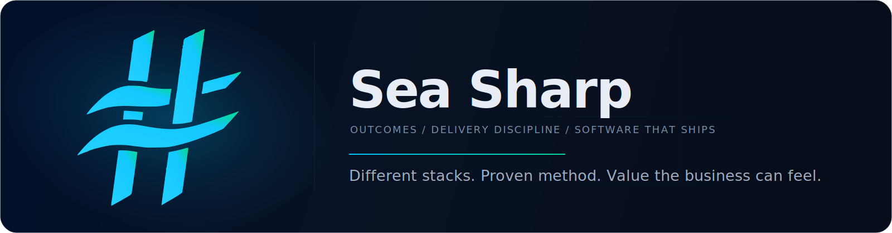

  

  Senior software consulting for companies with systems that matter and delivery that needs to get unstuck.

  Sea Sharp helps teams modernize core systems, make better technical decisions, and ship measurable progress without bloated teams, vendor theater, or hand-holding.

---

## Positioning

Sea Sharp is a boutique consultancy for organizations carrying real delivery risk: legacy systems nobody wants to touch, platform decisions that are getting expensive, modernization efforts that feel bigger every quarter, and teams that need senior help without adding more noise.

We do not sell headcount. We help clients get to better outcomes: clearer architecture, safer modernization paths, faster decision-making, stronger delivery rhythm, and software that your team can actually own when the work is done.

The stack is not the point. We work across cloud platforms, modern web stacks, distributed systems, data-heavy workflows, AI-assisted tooling, and legacy systems that still run the business. What stays consistent is the method: understand the real problem, make the trade-offs clear, and deliver value in ways the business can actually feel.

---

## Outcomes We Help Drive

| Outcome | What That Usually Means |
| --- | --- |
| Fewer expensive architecture mistakes | Reviews, discovery, trade-off analysis, and honest recommendations before commitment |
| Modernization without betting the business | Incremental migration paths, decomposition strategy, rollback thinking, risk control |
| Delivery that starts moving again | Senior engineers who can unblock teams, reduce churn, and turn ambiguity into execution |
| Platforms that are easier to operate | Better cloud decisions, simpler deployment paths, clearer engineering guardrails |
| Business-critical software built to last | Customer portals, internal platforms, processing systems, APIs, and distributed back ends |
| Faster learning on hard problems | Spikes, proofs of concept, technical due diligence, and practical pathfinding |
| Code your team can own | Open standards, maintainable systems, and no dependency on our continued presence |

---

## How We Work

Sea Sharp runs on a simple delivery model: start with the real constraint, ask the hard questions early, choose the right tool for the job, and create steady progress the client can see.

- We tell the truth, even when the truth is that you do not need us.
- We plan before we build so you do not pay to discover avoidable mistakes in production.
- We use a disciplined, Kanban-style delivery rhythm with steady, visible progress and no sprint theater.
- We use AI where it helps, but the judgment stays human and senior.
- We choose the stack based on the problem, not on ideology, habit, or lock-in.
- We build like the system will matter in five years, not just at the next demo.

---

## Featured Repositories

- [`architecture-principles`](https://github.com/seasharpco/architecture-principles) — Decision frameworks and patterns for high-consequence software work. COMING SOON!
- [`rules-engine`](https://github.com/seasharpco/rules-engine) — Components for turning complicated policy and workflow logic into maintainable systems. COMING SOON!

---

## Engagement

If you have a system that is hard to change, a team that is stuck, or a modernization effort that needs a credible path forward, that is the conversation we like to have.

Visit [seasharp.co](https://seasharp.co) to start a conversation.
